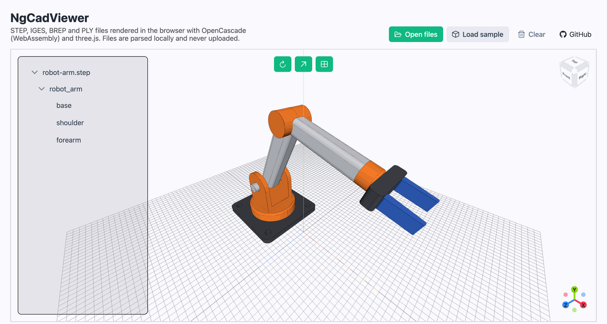
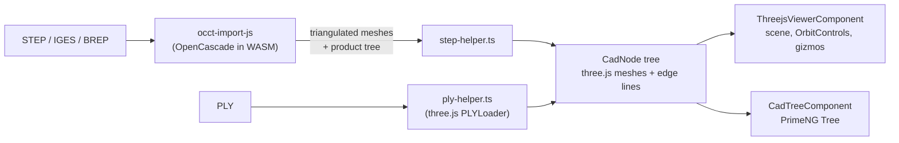

# NgCadViewer

An Angular component for viewing CAD files in the browser. STEP, IGES and BREP files are parsed with
[OpenCascade](https://dev.opencascade.org/) compiled to WebAssembly, and rendered with three.js. Everything
runs client-side: files are never uploaded anywhere.

**[Try the live demo →](https://p4gan.github.io/NgCadViewer/)**

[](https://github.com/P4GAN/NgCadViewer/actions/workflows/deploy-demo.yml)


[](https://p4gan.github.io/NgCadViewer/)

## Features

- **Real CAD formats.** STEP (`.step`, `.stp`), IGES (`.iges`, `.igs`) and BREP (`.brep`, `.brp`) through
  [occt-import-js](https://github.com/kovacsv/occt-import-js), plus PLY meshes through three.js's `PLYLoader`.
- **Assembly tree.** A PrimeNG tree panel shows the file's product structure alongside the 3D view.
- **Part colours** are taken from the file, with a neutral grey fallback.
- **Crisp B-rep edge outlines.** Each face's outline is drawn in black, so the model reads like a CAD drawing
  rather than a blob of shaded triangles (see [How it works](#how-it-works)).
- **CAD-style navigation.** Orbit, pan and zoom, a clickable view cube to snap to standard views, and an axis gizmo.
- **Fit to model.** The camera frames whatever is loaded, and the grid is resized to the model at 10 mm spacing so
  you get a sense of scale.
- **Multiple files at once.** Each file becomes its own root in the tree.

## How it works



1. **Parsing.** OpenCascade reads the file and tessellates every B-rep face into triangles. It returns one mesh per
   part (positions, normals, indices, colour) and a tree of named nodes that reference those meshes.
2. **Meshes.** [`step-helper.ts`](projects/ng-cad-viewer/src/lib/helpers/step-helper.ts) turns each OCCT mesh
   into a three.js `BufferGeometry` with a `MeshStandardMaterial`.
3. **Edge outlines.** OCCT also reports which range of triangles belongs to which original B-rep face. For each face,
   the helper counts every triangle edge. Edges shared by two triangles of the same face are internal to the
   tessellation and cancel out. The edges left over are exactly the face's boundary, and they become a
   `LineSegments` object. This gives true CAD edges instead of a wireframe of every triangle, and it avoids
   angle-threshold tricks like `EdgesGeometry` that miss edges between tangent faces.
4. **Rendering.** [`ThreejsViewerComponent`](projects/ng-cad-viewer/src/lib/components/threejs-viewer/threejs-viewer.component.ts)
   owns the scene. A directional "headlight" follows the camera so the side you're looking at is always lit, and
   [three-viewport-gizmo](https://github.com/Fennec-hub/three-viewport-gizmo) provides the view cube and axis gizmo.

## Using the component

The library isn't published to npm yet. To use it in another Angular 20 app, build it and install it from a local path:

```bash
# in this repo
npm install
npm run build:lib

# in your app
npm install /path/to/NgCadViewer/dist/ng-cad-viewer
npm install three three-viewport-gizmo primeng @primeuix/themes primeicons
```

Load occt-import-js from the CDN in your `index.html`. The component expects the global `occtimportjs` function
it defines:

```html
<script src="https://cdn.jsdelivr.net/npm/occt-import-js@0.0.22/dist/occt-import-js.min.js"></script>
```

Set up a PrimeNG theme, and add `node_modules/primeicons/primeicons.css` to `styles` in `angular.json`:

```ts
// app.config.ts
import { providePrimeNG } from 'primeng/config';
import Aura from '@primeuix/themes/aura';

export const appConfig: ApplicationConfig = {
  providers: [providePrimeNG({ theme: { preset: Aura } })],
};
```

Then drop the component in and hand it some `File`s:

```ts
import { Component, ViewChild } from '@angular/core';
import { NgCadViewer } from 'ng-cad-viewer';

@Component({
  selector: 'app-viewer',
  imports: [NgCadViewer],
  template: `
    <input type="file" multiple (change)="open($event)" />
    <ng-cad-viewer />
  `,
})
export class ViewerPage {
  @ViewChild(NgCadViewer) viewer!: NgCadViewer;

  open(event: Event) {
    const files = (event.target as HTMLInputElement).files;
    if (files) this.viewer.loadCADFiles(Array.from(files));
  }
}
```

### API

| Method | Description |
| --- | --- |
| `loadCADFiles(files: File[]): Promise<void>` | Parses the files and adds them to the scene and tree. If the WASM module is still downloading, it waits for it. |
| `clear(): void` | Removes all loaded models. |
| `resetView(): void` | Fits the camera to the loaded models. |
| `toggleAxes(): void` | Shows or hides the axes helper and gizmos. |
| `toggleGrid(): void` | Shows or hides the grid. |

The viewer also has its own toolbar buttons for reset, axes and grid.

## Project structure

```text
projects/
├── ng-cad-viewer/                      # the library
│   └── src/lib/
│       ├── ng-cad-viewer.ts            # <ng-cad-viewer>: public API, toolbar, loading overlay
│       ├── components/threejs-viewer/  # three.js scene, camera, controls, gizmos
│       ├── components/cad-tree/        # assembly tree panel
│       ├── helpers/step-helper.ts      # OCCT result → three.js meshes + B-rep edge outlines
│       ├── helpers/ply-helper.ts       # PLY → three.js mesh
│       └── types/occt-import-js.d.ts   # type declarations for occt-import-js
└── demo-app/                           # the GitHub Pages demo
scripts/generate_sample.py              # CadQuery script that generates the demo's sample model
.github/workflows/deploy-demo.yml       # builds and deploys the demo to GitHub Pages
```

## Development

Requires Node.js 20.19+, 22.12+ or 24+.

```bash
npm install
npm start       # builds the library, then serves the demo at http://localhost:4200
npm test        # unit tests for the library and demo (headless Chrome)
npm run build   # production build of the library and demo
```

The demo imports the library from `dist/`, so after changing library code, rebuild it with `npm run build:lib`,
or keep `npx ng build NgCadViewer --watch` running in a second terminal.

The robot arm in the demo is generated with [CadQuery](https://cadquery.readthedocs.io/) by
[`scripts/generate_sample.py`](scripts/generate_sample.py):

```bash
pip install cadquery
python scripts/generate_sample.py projects/demo-app/public/samples/robot-arm.step
```

### Deploying the demo

Every push to `main` builds the demo and deploys it to GitHub Pages. The workflow sets the base href from the
repository name, so it also works on forks. On a new repository, enable it once under
**Settings → Pages → Build and deployment → Source: GitHub Actions**.

## Known limitations

- **The assembly tree is only one level deep.** occt-import-js (tested with 0.0.22 and 0.0.23) merges nested
  sub-assemblies into their top-level parent. If the root assembly itself has a transform, the whole tree is
  flattened. Fixing this properly needs a custom OpenCascade WASM build or [opencascade.js](https://ocjs.org/).
- **The tree is display-only.** Every `CadNode` has `visible` and `selected` flags and the viewer honours them,
  but the tree panel doesn't set them yet.
- **Y-up only.** Models authored Z-up, which is common in CAD, appear rotated by 90°. There's no up-axis setting yet.
- **Parsing runs on the main thread**, so very large files freeze the page while they import. occt-import-js ships a
  Web Worker build that could fix this.
- occt-import-js is loaded from jsDelivr with a `<script>` tag rather than bundled, because Angular's build doesn't
  handle its WASM loader well.

## Acknowledgements

- [occt-import-js](https://github.com/kovacsv/occt-import-js) by Viktor Kovacs, which packages
  [Open CASCADE Technology](https://dev.opencascade.org/) for the browser (LGPL-2.1, loaded at runtime from jsDelivr)
- [three.js](https://threejs.org/) and [three-viewport-gizmo](https://github.com/Fennec-hub/three-viewport-gizmo)
- [PrimeNG](https://primeng.org/) for the UI components
